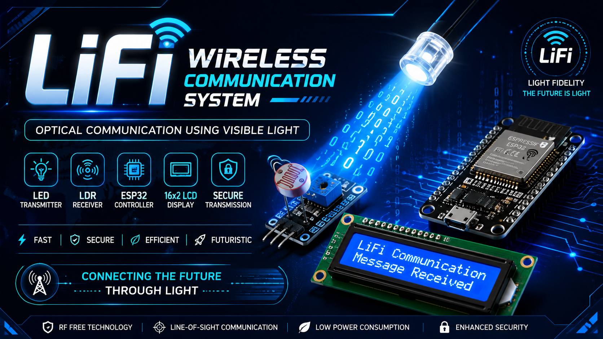
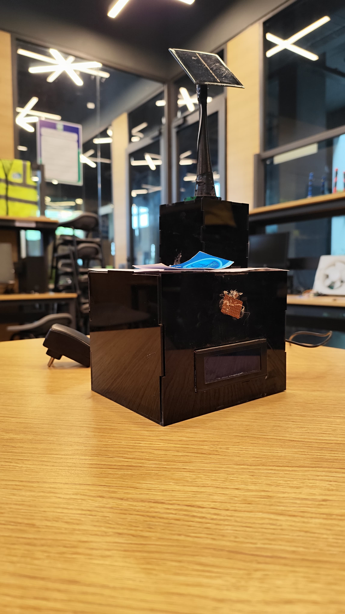
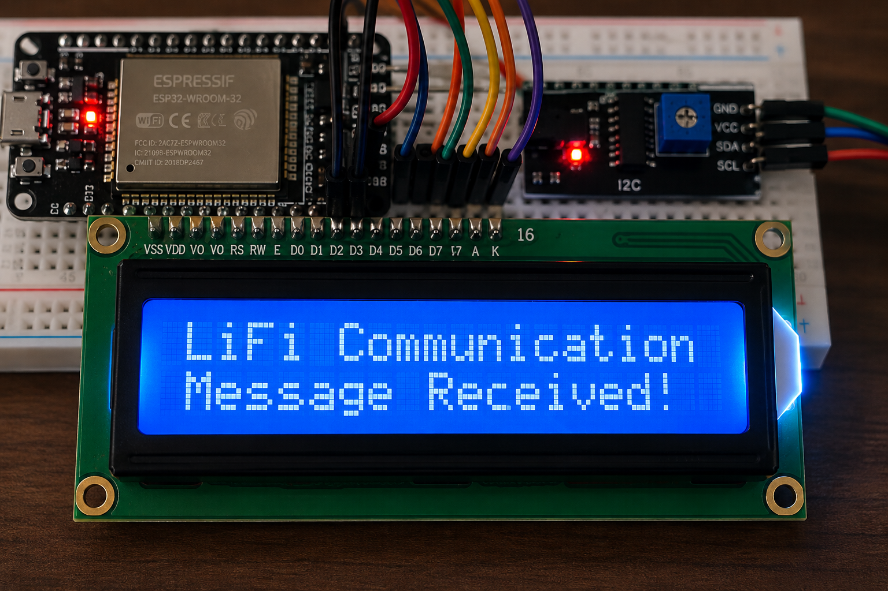

<div align="center">

# 💡 LiFi Wireless Communication System

### Optical Wireless Data Transmission using ESP32, LED & LDR



<br>


</div>

---

# 📊 Project Dashboard

| 🏷️ Project | 💡 LiFi Wireless Communication System |
|:-----------|:--------------------------------------|
| 🎯 Purpose | Secure Optical Wireless Communication |
| 🧠 Controller | ESP32 DevKit V1 |
| 💻 IDE | Arduino IDE |
| 📡 Technology | LiFi (Visible Light Communication) |
| 📺 Display | 16×2 I2C LCD |
| 🔦 Transmitter | High Brightness LED |
| 🌞 Receiver | LDR Module |
| 📅 Status | ✅ Completed |

---

# 🚀 What is LiFi?

LiFi (**Light Fidelity**) is a wireless communication technology that uses **visible light** instead of radio frequency (RF) to transmit data.

In this project, an **ESP32 transmitter** converts text into rapid LED light pulses. These pulses are detected by an **LDR sensor** connected to another ESP32. The received data is decoded and displayed on a **16×2 LCD**, demonstrating secure and efficient optical communication.

---

# 📸 Project Preview

## 💡 Complete LiFi System

<p align="center">

</p>

---

## 📟 LCD Output

<p align="center">

</p>

---

# ⚡ Highlights

<table>

<tr>
<td>💡 Visible Light Communication</td>
<td>🧠 ESP32 Based</td>
</tr>

<tr>
<td>🔦 LED Transmitter</td>
<td>🌞 LDR Receiver</td>
</tr>

<tr>
<td>📟 LCD Output</td>
<td>⚡ Real-Time Communication</td>
</tr>

<tr>
<td>🔒 Secure Communication</td>
<td>🌍 IoT Ready</td>
</tr>

</table>

---

# 🛠 Hardware Used

| Component | Function |
|-----------|----------|
| ESP32 DevKit V1 | Main Controller |
| High Brightness LED | Optical Transmitter |
| LDR Module | Optical Receiver |
| 16×2 LCD | Display Received Message |
| Breadboard | Circuit Assembly |
| Jumper Wires | Connections |
| USB Cable | Power Supply |

---

# 📡 Communication Flow

```text
        TEXT MESSAGE
             │
             ▼
      ESP32 TRANSMITTER
             │
             ▼
       LED LIGHT SIGNALS
             │
════════════ AIR ════════════
             │
             ▼
        LDR DETECTOR
             │
             ▼
       ESP32 RECEIVER
             │
             ▼
       LCD DISPLAY OUTPUT
```

---

# 📁 Repository Layout

```text
LiFi-Wireless-Communication-System/
│
├── README.md
│
├── code/
│   ├── transmitter.ino
│   └── receiver.ino
│
├── docs/
│   └── Documentation.md
│
├── hardware/
│   ├── Block_Diagram.png
│   └── Circuit_Diagram.png
│
├── images/
│   ├── lifi-banner.png
│   ├── lifi-system.jpg
│   └── lcd-output.png
│
└── video/
    └── demo-link.txt
```

---

# 🚀 Quick Setup

### Software

- Arduino IDE
- ESP32 Board Package
- Wire Library
- LiquidCrystal_I2C Library

### Steps

✅ Build the transmitter circuit

✅ Build the receiver circuit

✅ Upload `transmitter.ino`

✅ Upload `receiver.ino`

✅ Power both ESP32 boards

✅ Send a message

✅ Observe the LCD output

---

# 🌍 Applications

| Domain | Example |
|---------|---------|
| 🏠 Smart Homes | Device Communication |
| 🏭 Industries | Automation |
| 🏥 Hospitals | RF-Free Communication |
| ✈ Aviation | Secure Data Transfer |
| 🎓 Education | Embedded Systems Learning |
| 🌊 Marine Research | Underwater Optical Communication |

---

# 📈 Advantages

| Feature | Benefit |
|----------|---------|
| 🔒 Secure | Line-of-Sight Communication |
| 📶 RF-Free | No Radio Interference |
| ⚡ Fast | Instant Data Transfer |
| 🌱 Efficient | Low Power Consumption |
| 💰 Affordable | Low-Cost Hardware |
| 🧩 Modular | Easy to Expand |

---

# 🔮 Future Enhancements

- 📱 Mobile Application
- ☁ Cloud Connectivity
- 🎤 Audio Transmission
- 🎥 Video Transmission
- 🤖 AI Integration
- 🌐 Hybrid LiFi + Wi-Fi
- 📊 Analytics Dashboard

---

# 📂 Documentation

The repository includes:

- 📘 Complete Documentation
- 🖼 Block Diagram
- 🔌 Circuit Diagram
- 💻 ESP32 Source Code
- 📸 Project Images
- 🎥 Demonstration Video

---

# 👨‍💻 Developer

**Mukul Vaid** 


</div>

---

# 📜 License

This project is developed for educational and research purposes.

---

<div align="center">

# ⭐ Like this Project?

If this project helped you, please consider giving it a **Star ⭐** on GitHub.

---

### 🚀 NeoGen Innovators

**Build • Learn • Innovate**

Made with ❤️ using **ESP32 & LiFi Technology**

</div>
